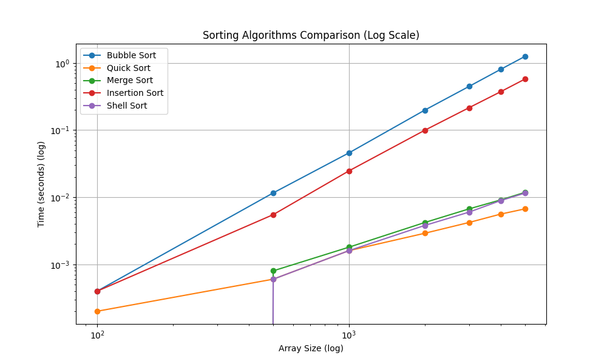
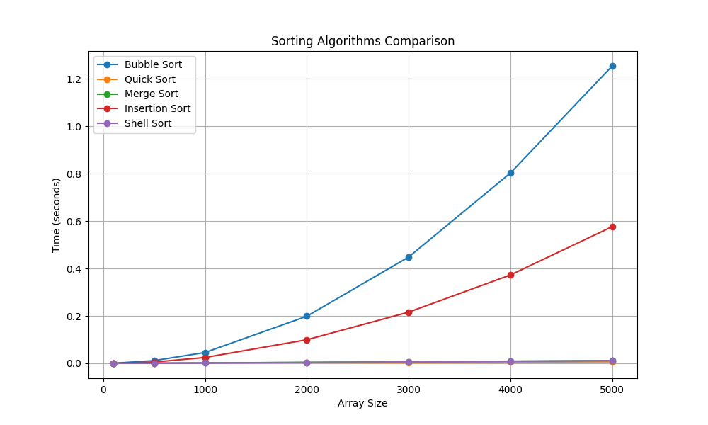

# Sorting Algorithms Analysis

### Author: [Diego Cardenas](github.com/diegcard)
### Institution: Escuela Colombiana de Ingeniería Julio Garavito
### Professor: [Rafael Niquefa](github.com/niquefa)
### Signature: Algoritmo y Representación de Datos

## Introduction

This project is a study of the most common sorting algorithms, their complexity and their performance. The algorithms studied are:

* Bubble Sort
* Quick Sort
* Merge Sort
* insertion Sort
* Shell Sort

# Running locally and testing

* Note: This instructions are for mac. Windows or linux may require some changes.
* A good idea for this project, is to use a virtual environment, you could set up one with: [virtualenv](https://virtualenv.pypa.io/en/latest/).
* To create the virtual environment: `virtualenv env`
* To activate it:`source env/bin/activate`
* To install dependencies: `pip install -r requirements.txt`
* Execute `python app.py` to run the application

# python version

Python 3.11.0

# Algorithms

## Bubble Sort

Bubble sort is a simple sorting algorithm that repeatedly steps through the list, compares adjacent elements and swaps them if they are in the wrong order. The pass through the
list is repeated until the list is sorted. The algorithm, which is a comparison sort, is named for the way smaller elements "bubble" to the top of the list. Although the algorithm is simple, it is too slow and impractical for most problems even when compared to insertion sort. It can be practical if the input is in mostly sorted order with some out-of-place elements nearly in position.

* Worst-case performance: O(n^2)
* Best-case performance: O(n)
* Average performance: O(n^2)

## Quick Sort

Quicksort is an efficient sorting algorithm, serving as a systematic method for placing the elements of an array in order. Developed by Tony Hoare in 1959 and published in 1961, it is still a commonly used algorithm for sorting. When implemented well, it can be about two or three times faster than its main competitors, merge sort and heapsort.

Quicksort is a comparison sort and, in efficient implementations, is not a stable sort. Quicksort can be implemented with an in-place partitioning algorithm, so the entire sort can be done with only O(log n) additional space used by the stack during the recursion.

* Worst-case performance: O(n^2)
* Best-case performance: O(n log n) (simple partition)
* Average performance: O(n log n)

## Merge Sort

Merge sort is an efficient, stable, comparison-based sorting algorithm. Most implementations produce a stable sort, which means that the implementation preserves the input order of equal elements in the sorted output. Merge sort is a divide and conquer algorithm that was invented by John von Neumann in 1945.

An example of merge sort. First divide the list into the smallest unit (1 element), then compare each element with the adjacent list to sort and merge the two adjacent lists. Finally all the elements are sorted and merged.

* Worst-case performance: O(n log n)
* Best-case performance: O(n log n) typical, O(n) natural variant
* Average performance: O(n log n)

## Insertion Sort

Insertion sort is a simple sorting algorithm that builds the final sorted array (or list) one item at a time. It is much less efficient on large lists than more advanced algorithms such as quicksort, heapsort, or merge sort. However, insertion sort provides several advantages:

* Worst-case performance: O(n^2)
* Best-case performance: O(n)
* Average performance: O(n^2)

## Shell Sort

Shellsort, also known as Shell sort or Shell's method, is an in-place comparison sort. It can be seen as either a generalization of sorting by exchange (bubble sort) or sorting by insertion (insertion sort). The method starts by sorting pairs of elements far apart from each other, then progressively reducing the gap between elements to be compared. Starting with far apart elements, it can move some out-of-place elements into position faster than a simple nearest neighbor exchange.

* Worst-case performance: O(n^2)
* Best-case performance: O(n log n)
* Average performance: depends on gap sequence

## Graphs

The graphs are generated using the matplotlib library. The graphs show the time it takes to sort an array of size n. The x-axis represents the size of the array and the y-axis represents the time in seconds.





## Conclusion

The best algorithm for sorting is the merge sort algorithm. It has a time complexity of O(n log n) and is very efficient for large arrays. The worst algorithm is the bubble sort algorithm, which has a time complexity of O(n^2) and is very inefficient for large arrays.

## Coverage

Make sure you have "coverage" in your requirements.txt file and run pip install. Then run `coverage run -m unittest discover` and after that run `coverage report` to get the following table:

```
Name                           Stmts   Miss  Cover   Missing
------------------------------------------------------------
sort\__init__.py                   0      0   100%
sort\algorithms.py                38      0   100%
sort\constants.py                  2      0   100%
sort\data_generator.py             4      0   100%
tests\__init__.py                  0      0   100%
tests\test_algorithms.py          17      0   100%
tests\test_data_generator.py      11      0   100%
------------------------------------------------------------
```

# Code beautify

To beautify the code, you can use the command `black . -l 120` to format the code. Make sure you have black installed in your environment.
