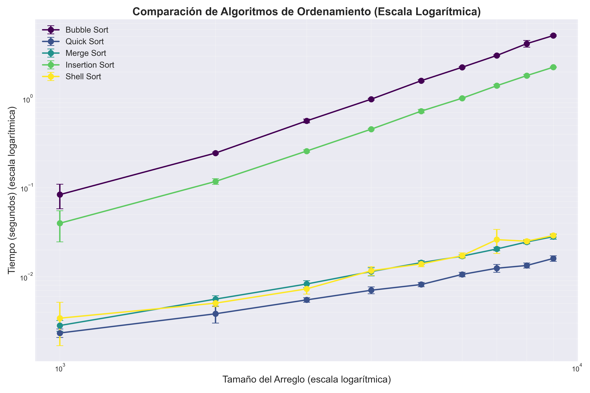
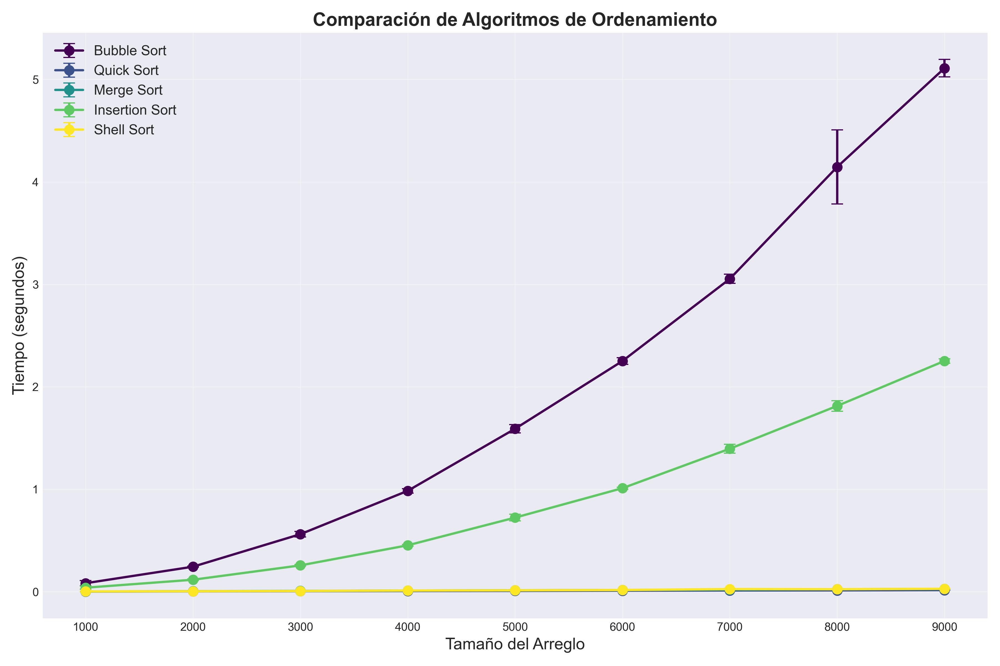

# 🔄 Sorting Algorithms Analysis

<div align="center">


**A comprehensive analysis of common sorting algorithms and their performance metrics**

</div>

## 📋 Table of Contents
- [Overview](#-overview)
- [Algorithms](#-algorithms)
- [Results](#-results)
- [Installation](#-installation)
- [Usage](#-usage)
- [Testing & Code Quality](#-testing--code-quality)
- [Author & Credits](#-author--credits)

## 🔍 Overview

This project provides an in-depth study of five classic sorting algorithms, analyzing their time complexity and practical performance across various input sizes. The implementation is optimized for clarity and educational purposes.

**Algorithms Analyzed:**
- Bubble Sort
- Quick Sort
- Merge Sort
- Insertion Sort
- Shell Sort

## 🧮 Algorithms

### Bubble Sort
<details>
<summary>Implementation & Analysis</summary>

Bubble sort works by repeatedly stepping through the list, comparing adjacent elements, and swapping them if they're in the wrong order.

```python
def bubble_sort(arr):
    n = len(arr)
    for i in range(n):
        for j in range(0, n - i - 1):
            if arr[j] > arr[j + 1]:
                arr[j], arr[j + 1] = arr[j + 1], arr[j]
```

**Complexity:**
- **Time Complexity (Worst):** O(n²)
- **Time Complexity (Best):** O(n)
- **Time Complexity (Average):** O(n²)
- **Space Complexity:** O(1)

**Best Use Cases:** Small datasets or nearly sorted arrays

</details>

### Quick Sort
<details>
<summary>Implementation & Analysis</summary>

Quicksort is a divide-and-conquer algorithm that selects a 'pivot' element and partitions the array around it.

```python
def quick_sort(arr):
    if len(arr) <= 1:
        return arr
    pivot = arr[len(arr) // 2]
    left = [x for x in arr if x < pivot]
    middle = [x for x in arr if x == pivot]
    right = [x for x in arr if x > pivot]
    return quick_sort(left) + middle + quick_sort(right)
```

**Complexity:**
- **Time Complexity (Worst):** O(n²)
- **Time Complexity (Best):** O(n log n)
- **Time Complexity (Average):** O(n log n)
- **Space Complexity:** O(log n)

**Best Use Cases:** General-purpose sorting, large datasets

</details>

### Merge Sort
<details>
<summary>Implementation & Analysis</summary>

Merge sort divides the array into smaller subarrays, sorts them, and then merges them back together.

```python
def merge_sort(arr):
    if len(arr) <= 1:
        return arr
        
    mid = len(arr) // 2
    left = merge_sort(arr[:mid])
    right = merge_sort(arr[mid:])
    
    return merge(left, right)
    
def merge(left, right):
    result = []
    i = j = 0
    
    while i < len(left) and j < len(right):
        if left[i] <= right[j]:
            result.append(left[i])
            i += 1
        else:
            result.append(right[j])
            j += 1
            
    result.extend(left[i:])
    result.extend(right[j:])
    return result
```

**Complexity:**
- **Time Complexity (Worst):** O(n log n)
- **Time Complexity (Best):** O(n log n)
- **Time Complexity (Average):** O(n log n)
- **Space Complexity:** O(n)

**Best Use Cases:** When stability is required, external sorting

</details>

### Insertion Sort
<details>
<summary>Implementation & Analysis</summary>

Insertion sort builds the final sorted array one item at a time.

```python
def insertion_sort(arr):
    for i in range(1, len(arr)):
        key = arr[i]
        j = i - 1
        while j >= 0 and arr[j] > key:
            arr[j + 1] = arr[j]
            j -= 1
        arr[j + 1] = key
```

**Complexity:**
- **Time Complexity (Worst):** O(n²)
- **Time Complexity (Best):** O(n)
- **Time Complexity (Average):** O(n²)
- **Space Complexity:** O(1)

**Best Use Cases:** Small datasets, online algorithms (sorting as data arrives)

</details>

### Shell Sort
<details>
<summary>Implementation & Analysis</summary>

Shell sort is an optimization of insertion sort that allows the exchange of items that are far apart.

```python
def shell_sort(arr):
    n = len(arr)
    gap = n // 2
    
    while gap > 0:
        for i in range(gap, n):
            temp = arr[i]
            j = i
            while j >= gap and arr[j - gap] > temp:
                arr[j] = arr[j - gap]
                j -= gap
            arr[j] = temp
        gap //= 2
```

**Complexity:**
- **Time Complexity (Worst):** O(n²)
- **Time Complexity (Best):** O(n log n)
- **Time Complexity (Average):** Depends on gap sequence
- **Space Complexity:** O(1)

**Best Use Cases:** Medium-sized datasets

</details>

## 📊 Results

### Performance Comparison

The following table shows the execution time (in milliseconds) for each algorithm across different array sizes:

<div align="center">

| Size  | Bubble Sort | Quick Sort | Merge Sort | Insertion Sort | Shell Sort |
|-------|-------------|------------|------------|----------------|------------|
| 1000  | 5116        | 99         | 295        | 2557           | 200        |
| 2000  | 22502       | 1387       | 2283       | 17159          | 602        |
| 3000  | 50634       | 606        | 800        | 24176          | 650        |
| 4000  | 87385       | 718        | 1053       | 41786          | 1056       |
| 5000  | 166018      | 1011       | 1326       | 61688          | 1283       |
| 6000  | 207827      | 1508       | 1913       | 104765         | 1910       |
| 7000  | 276434      | 1389       | 1904       | 123240         | 1961       |
| 8000  | 354999      | 1602       | 2104       | 161238         | 2323       |
| 9000  | 451134      | 1914       | 2635       | 205463         | 2770       |
| 10000 | 558828      | 1924       | 3004       | 241882         | 3199       |
| 11000 | 690302      | 2038       | 3168       | 300610         | 2873       |
| 12000 | 797044      | 2262       | 3977       | 348223         | 3807       |
| 13000 | 974349      | 2552       | 3935       | 410077         | 3955       |
| 14000 | 1082525     | 2972       | 4186       | 472434         | 4173       |
| 15000 | 1251297     | 3032       | 4595       | 553984         | 4689       |

</div>

### Visualization

<div align="center">

</div>

<details>
<summary>Additional Visualizations</summary>
<div align="center">



</div>
</details>

### Key Findings

- **Quick Sort** consistently performs best for all tested array sizes
- **Merge Sort** provides stable O(n log n) performance regardless of input
- **Bubble Sort** and **Insertion Sort** demonstrate quadratic growth, making them impractical for large datasets
- **Shell Sort** offers a good compromise for medium-sized arrays

## 🚀 Installation

```bash
# Clone the repository
git clone https://github.com/diegcard/sorting-algorithms.git
cd sorting-algorithms

# Create and activate virtual environment (recommended)
python -m venv env
source env/bin/activate  # On Windows: env\Scripts\activate

# Install dependencies
pip install -r requirements.txt
```

## 💻 Usage

```bash
# Run the main application
python app.py

# Generate comparison graphs
python -c "from sort import compare_and_plot_algorithms; compare_and_plot_algorithms([1000, 5000, 10000, 15000], algorithms_dict, 5)"
```

## 🧪 Testing & Code Quality

```bash
# Run all tests
python -m unittest discover

# Generate test coverage report
coverage run -m unittest discover
coverage report

# Format code using Black
black . -l 120
```

### Test Coverage

```
Name                           Stmts   Miss  Cover   Missing
------------------------------------------------------------
sort\__init__.py                   0      0   100%
sort\algorithms.py                38      0   100%
sort\constants.py                  2      0   100%
sort\data_generator.py             4      0   100%
tests\__init__.py                  0      0   100%
tests\test_algorithms.py          17      0   100%
tests\test_data_generator.py      11      0   100%
------------------------------------------------------------
TOTAL                             72      0   100%
```

## 👥 Author & Credits

- **Author:** [Diego Cardenas](https://github.com/diegcard)
- **Institution:** Escuela Colombiana de Ingeniería Julio Garavito
- **Professor:** [Rafael Niquefa](https://github.com/niquefa)
- **Course:** Algorithms and Data Representation

## 📄 License

This project is licensed under the MIT License - see the LICENSE file for details.

---

<div align="center">
⭐ Star this repository if you found it useful! ⭐
</div>